# GraphShield AML

GraphShield AML is a graph-native, human-controlled anti-money-laundering investigation-support prototype. It prioritizes transaction alerts and assembles point-in-time graph, model, case, and policy evidence for a human investigator. It is a portfolio/research system built with synthetic or public material.

**Live Demo**
* UI: https://portfolio-sandy-eta-4ipb9hl1lz.vercel.app
* API: https://graphshield-api-production.up.railway.app
* Docs: https://graphshield-api-production.up.railway.app/docs

Public capabilities:
case queue, overview, graph/path investigation, explainability, evidence search, policy search.

Architecture:
Vercel → Railway FastAPI → GraphShield models/artifacts.

> Decision support only. GraphShield does not block accounts, close cases, file SAR/STRs, submit regulatory reports, or replace legal, compliance, or investigator judgement.
> It uses synthetic or public benchmark data and requires human review for any investigation outcomes.

## Reviewer quick facts

### WHAT IS GRAPHSHIELD?
GraphShield AML is a graph-native, human-controlled investigation-support prototype for AML alert triage. It assembles transaction, graph, policy, and case evidence around a suspicious activity review flow, but leaves decisions and any external action to the investigator.

### WHAT IS ACTUALLY IMPLEMENTED?
The repo contains implemented data normalization, feature engineering, model pipelines, graph investigations, evidence bundles, policy retrieval, API/UI services, and governance guardrails. The main review path is: source data -> canonical features -> risk-ranked cases -> investigation evidence -> policy context -> human review.

### WHAT IS SYNTHETIC / HISTORICAL?
This project uses synthetic IBM AML-style data, local processed artifacts, historical certification reports, and demo outputs. Those artifacts are useful evidence for workflow design and repository validation, but they are not fresh live-bank evidence.

### WHAT IS NOT CLAIMED?
GraphShield does not claim autonomous compliance enforcement, regulatory filing, customer blocking, legal conclusions, or a production banking deployment. It also does not claim live cloud readiness or external-system security certification.

### WHERE SHOULD A REVIEWER START?
- [Project Architecture](docs/architecture/PROJECT_ARCHITECTURE.md)
- [Phase Index](docs/architecture/PHASE_INDEX.md)
- [Safety Invariants](docs/architecture/SAFETY_INVARIANTS.md)
- [Validation](docs/VALIDATION.md)
- [Limitations](docs/LIMITATIONS.md)
- [Running](docs/RUNNING.md)
- [Demo Scenarios](docs/demo/DEMO_SCENARIOS.md)
- [Benchmarks & Evidence](docs/evidence/BENCHMARKS_AND_EVIDENCE.md)

## The problem

Transaction-monitoring teams must triage many alerts with limited time and incomplete context. A transaction alone does not show recent velocity, counterparty history, network structure, or the surrounding evidence needed to investigate it. GraphShield connects these views into an evidence-oriented review workflow while keeping the investigator responsible for every decision.

## What is implemented

- Canonical transaction normalization, chronological splits, and point-in-time history, velocity, counterparty, pair, concentration, and graph features.
- Rule alerts plus logistic-regression, LightGBM, CatBoost, and temporal graph-network research pipelines.
- Transaction-to-account graph tables, point-in-time graph evidence, circular-flow candidates, community detection, risk propagation, and motif signals.
- Risk-ranked case queues, materialized case bundles, subgraphs, paths, evidence documents, and a separate analyst-review state store.
- Model explanation through TreeSHAP for the frozen graph LightGBM component, deterministic reason codes, graph evidence, and temporal context.
- Policy retrieval over locally indexed FATF, FinCEN, FIU-IND, and RBI documents, with citations and grounding checks.
- A bounded Phase 12 investigation agent with six allowlisted read-only tools and fail-closed grounding behavior.
- Governance controls for append-only feedback, adjudication, drift/performance observation, and human-gated retraining proposals.
- FastAPI services, Streamlit interfaces, Docker/Kubernetes readiness contracts, artifact-integrity checks, and release/recovery contracts.

See [the project architecture](docs/architecture/PROJECT_ARCHITECTURE.md) for the implemented data flow and [limitations](docs/LIMITATIONS.md) for the important boundaries.

## Architecture at a glance

```mermaid
flowchart LR
    A[Synthetic/public transaction data] --> B[Canonical silver data]
    B --> C[Point-in-time features and graph tables]
    C --> D[Rules and ML/TGN scoring]
    D --> E[Risk-ranked case queue]
    E --> F[Case bundles, paths, and subgraphs]
    F --> G[Explanation and policy retrieval]
    G --> H[Bounded investigation assistance]
    H --> I[Human investigator review]
    I --> J[Auditable feedback and governance]
```



The workflow is deliberately evidence-first: risk ranking informs what to review; it does not determine an enforcement or reporting outcome.

## Graph and temporal intelligence

The core graph representation connects transaction events to sender and receiver accounts. It derives point-in-time degree, pair-history, concentration, bank, and motif features before the focal event. Phase 9 adds account-risk aggregation, three-hop propagation, Louvain community analysis, and rapid pass-through/two-node-cycle signals. Neo4j loaders are included as an optional integration; local graph artifacts and NetworkX-based analysis are the demonstrated code path.

Temporal Graph Network code uses PyTorch Geometric to construct time-ordered event data and train/evaluate a TGN component. The later Phase 10 artifact set records a frozen graph/TGN fusion candidate. Model lineage is versioned across phases; consult [Validation](docs/VALIDATION.md) before comparing older champion reports with the later fusion artifacts.

## Investigation, explanation, and policy evidence

1. Rank candidate transactions into an analyst case queue.
2. Retrieve the case overview, point-in-time subgraph, paths, history, and evidence documents.
3. Present separate explanation channels: graph-LightGBM TreeSHAP, deterministic reason codes, graph evidence, and temporal context. TGN context is not presented as SHAP attribution.
4. Retrieve policy context from the local corpus with document/chunk citations.
5. Let the bounded investigation agent collect only allowlisted, read-only evidence and withhold unsupported answers.
6. Leave final assessment and disposition to the human investigator.

## Phase status

Repository history and stored certification artifacts support implementation through Phase 15. Phases 1–8 cover data, features, ML, graph intelligence, temporal work, investigation/RAG, service integration, and productization. Phases 8.5–15 extend platform foundations, online graph intelligence, real-time fusion, explainability, bounded investigation, governance, enterprise readiness, and reliability.

These are historical artifacts, not a claim that this checkout has freshly rerun every certification. There is no formal Phase 0 definition or certification in the repository; the initial project commit is documented only as bootstrap/history. The detailed, evidence-oriented record is in [Phase Index](docs/architecture/PHASE_INDEX.md).

## Validation and safety

- The repository contains 34 test files with 83 test functions, primarily covering service contracts and Phases 11–15.
- Earlier phases retain validation scripts, reports, hashes, and certification artifacts.
- Current CI is lightweight and does not execute the full test suite; the active branch is also outside its configured `master`/`main` triggers.
- Stored Phase 15 smoke evidence is explicitly in-process and does not establish cloud networking, production traffic, or achieved SLOs.

Read [Validation](docs/VALIDATION.md), [Safety Invariants](docs/architecture/SAFETY_INVARIANTS.md), and [Limitations](docs/LIMITATIONS.md) before relying on the system or its reported artifacts.

## Local demonstration

The repository includes FastAPI and Streamlit entry points. A local environment with the required ignored data/model artifacts is required.

```powershell
# API
.\.venv\Scripts\python.exe -m uvicorn api.app:app --app-dir src --host 127.0.0.1 --port 8000

# Analyst UI
$env:GRAPHSHIELD_API_URL="http://127.0.0.1:8000"
.\.venv\Scripts\python.exe -m streamlit run src\frontend\app.py --server.port 8502
```

This is a local demonstration path, not a production deployment guide. Runtime artifacts under `data/` and `models/` are intentionally Git-ignored; see [Limitations](docs/LIMITATIONS.md#artifact-and-environment-reproducibility).

## Documentation map

- [Project Architecture](docs/architecture/PROJECT_ARCHITECTURE.md) — implemented components and data flow.
- [Phase Index](docs/architecture/PHASE_INDEX.md) — roadmap recovery with evidence status.
- [Safety Invariants](docs/architecture/SAFETY_INVARIANTS.md) — non-autonomy and evidence boundaries.
- [Validation](docs/VALIDATION.md) — what is tested, certified historically, and not freshly verified.
- [Limitations](docs/LIMITATIONS.md) — operational, data, model, and reproducibility limitations.
- [Demo script](docs/DEMO_SCRIPT.md) — a bounded portfolio demonstration.

## Scope

GraphShield is intended to demonstrate engineering patterns for AML investigation support, not to claim real-bank deployment, regulatory certification, guaranteed detection performance, or legal conclusions.