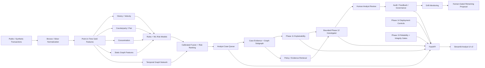
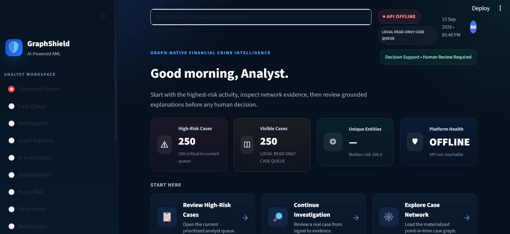
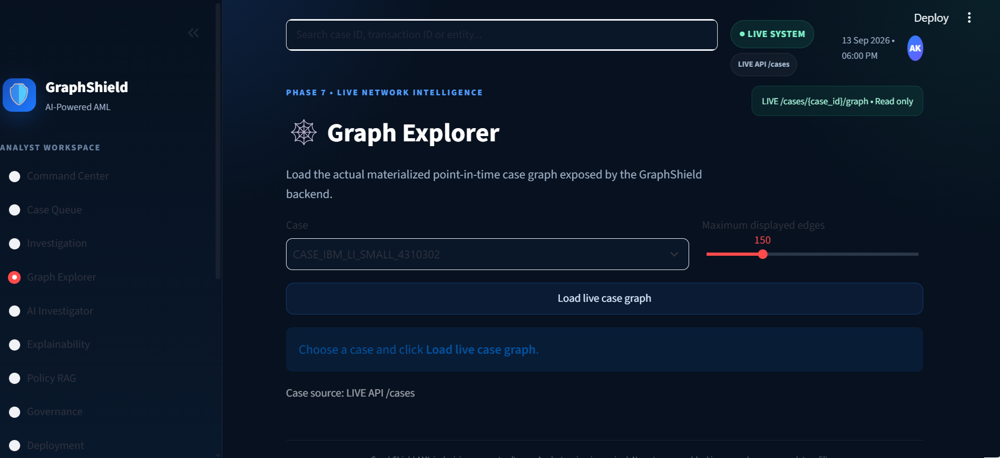
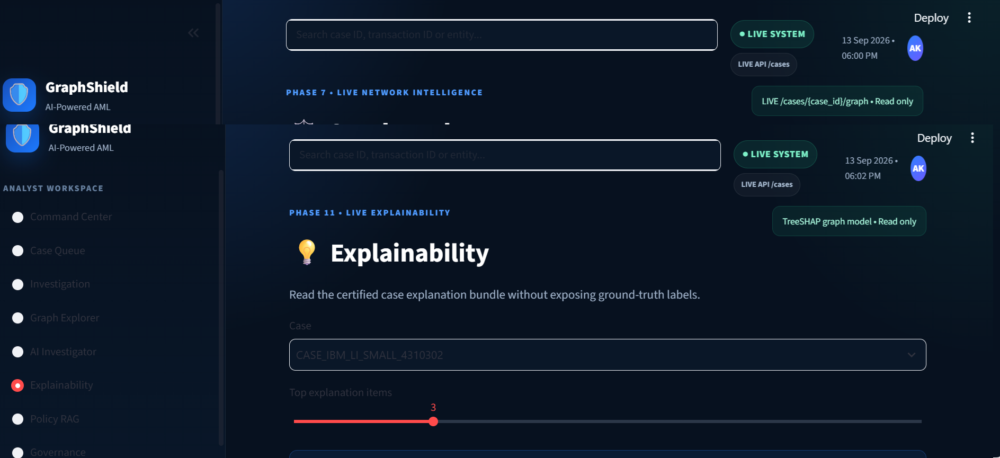

# GraphShield AML

**Graph-native AML alert prioritization and investigation support with explainable ML, temporal graph intelligence, evidence-grounded RAG, and human-controlled review.**

> Portfolio / academic research prototype built with public or synthetic data.  
> GraphShield is **decision support**, not an autonomous compliance engine.

## Why GraphShield

Traditional transaction-monitoring systems can generate more alerts than investigators can review with equal depth. A single transaction row also misses important context: account history, recent velocity, counterparties, repeated relationships, network structure, and evolving graph behavior.

GraphShield converts that alert stream into a **risk-ranked, explainable, evidence-linked investigation workflow**:

**Transactions → Point-in-time features → Rules + ML → Graph/TGN intelligence → Calibration & ranking → Case evidence → Explainability → Policy-grounded investigation → Human review**

## Product workflow

1. **Command Center** — inspect live system state and high-priority cases.
2. **Case Queue** — review a ranked analyst queue.
3. **Investigation** — inspect the selected case and supporting evidence.
4. **Graph Explorer** — visualize the materialized point-in-time transaction network.
5. **Explainability** — separate model attribution, deterministic reason codes, graph evidence, and temporal context.
6. **AI Investigator** — run a bounded, read-only investigation agent.
7. **Policy RAG** — retrieve grounded policy context with citations.
8. **Governance** — monitor drift and governance gates without automatic retraining.
9. **Deployment & Reliability** — inspect readiness, integrity, and release evidence.

## Architecture



## Core capabilities

### Leak-aware temporal data engineering
GraphShield builds historical, velocity, counterparty, pair, concentration, and graph features using information available **before the focal event**. Chronological train/validation/test splits are used to reduce temporal leakage.

### ML + graph intelligence
The project compares transparent and boosted tabular approaches and adds relational context through graph features and a Temporal Graph Network. The final certified Phase 10 stack is frozen for later phases rather than silently retrained.

### Explainable AML
Phase 11 provides:
- TreeSHAP for the frozen LightGBM graph model
- deterministic AML reason codes
- graph evidence
- temporal/TGN context
- fusion-component explanation
- deterministic analyst summaries
- no runtime exposure of ground-truth labels

### Bounded agentic investigation
Phase 12 uses only allowlisted, read-only investigation tools:
- `case_overview`
- `search_evidence`
- `path_evidence`
- `history_evidence`
- `policy_search`
- `phase11_explanation`

The agent collects supporting and countervailing evidence, drafts a grounded response, validates citations, and fails closed when grounding is insufficient.

### Governance-first MLOps
Phase 13 monitors feature/score drift and analyst feedback while enforcing:
- no automatic retraining
- no automatic recalibration
- no automatic promotion
- no automatic threshold changes
- human approval for any model-change proposal

### Enterprise runtime and reliability
Phases 14–15 add:
- Docker / Kubernetes deployment contracts
- readiness and liveness endpoints
- artifact-integrity checks
- hardened non-root runtime assumptions
- release-readiness gates
- recovery / rollback verification
- reliability certification

These checks establish **readiness contracts**, not production-SLO attainment.

## Technology stack

| Layer | Technologies |
|---|---|
| Data | Python, Polars, Pandas, Parquet, PyArrow |
| ML | scikit-learn, LightGBM, CatBoost, joblib |
| Graph / Temporal | graph analytics, PyTorch, Temporal Graph Network |
| Retrieval / AI | RAG, policy retrieval, grounded LLM workflow |
| API | FastAPI, Pydantic |
| UI | Streamlit |
| Governance | drift monitoring, append-only feedback/audit controls |
| Deployment | Docker, Kubernetes |
| Reliability | readiness, liveness, artifact integrity, release gates |
| Quality | pytest, validation scripts, versioned certification artifacts |

## Certified project status

GraphShield is complete through **Phase 15**.

- Phase 10 — Real-Time Streaming + Temporal Fusion: **certified**
- Phase 11 — Explainable AML: **certified**
- Phase 12 — Agentic Investigation: **certified**
- Phase 13 — Feedback / Drift / MLOps Governance: **certified**
- Phase 14 — Enterprise Platform / Cloud: **certified**
- Phase 15 — Reliability / Final Release: **certified**

Final repository tags include:

```text
graphshield-v2-phase13-certified
graphshield-v2-phase14-certified
graphshield-v2-phase15-certified
graphshield-v2-final
```

## UI preview

Add the final screenshots here after running UI v2 Batch 7:

```text
docs/screenshots/01-command-center.png
docs/screenshots/02-case-queue.png
docs/screenshots/03-investigation.png
docs/screenshots/04-graph-explorer.png
docs/screenshots/05-explainability.png
docs/screenshots/06-ai-investigator.png
docs/screenshots/07-policy-rag.png
docs/screenshots/08-governance.png
docs/screenshots/09-deployment.png
```

Recommended README layout after screenshots are captured:

```markdown



```

## Local demo

### Terminal 1 — FastAPI

```powershell
.\.venv\Scripts\python.exe -m uvicorn api.app:app --app-dir src --host 127.0.0.1 --port 8000
```

### Terminal 2 — Analyst UI v2

```powershell
$env:GRAPHSHIELD_API_URL="http://127.0.0.1:8000"
.\.venv\Scripts\python.exe -m streamlit run src\frontend\app.py --server.port 8502
```

Open:

```text
http://localhost:8502
```

## Suggested evaluator demo

**Case Queue → Investigation → Graph Explorer → Explainability → AI Investigator → Policy RAG → Governance**

The intended takeaway is not simply that GraphShield produces a risk score. It organizes **risk → evidence → explanation → grounded review → human decision**.

## Safety and scope

GraphShield deliberately does **not**:
- autonomously block accounts
- autonomously close cases
- file SAR/STR reports
- submit regulatory reports
- treat analyst feedback as automatic ground truth
- automatically retrain or promote certified models
- claim production SLO attainment from local/in-process tests

The system uses public or synthetic data and keeps human review mandatory.

## Project identity

**Abhay Kumar**  
B.E./B.Tech — Artificial Intelligence & Machine Learning  
Sri Krishna Institute of Technology, Bengaluru  
Visvesvaraya Technological University

---

### Portfolio summary

GraphShield AML demonstrates end-to-end engineering across **data pipelines, ML, temporal graph intelligence, explainability, RAG, agentic investigation, FastAPI, Streamlit, governance, Docker/Kubernetes, and reliability engineering** in one human-controlled financial-crime investigation workflow.
