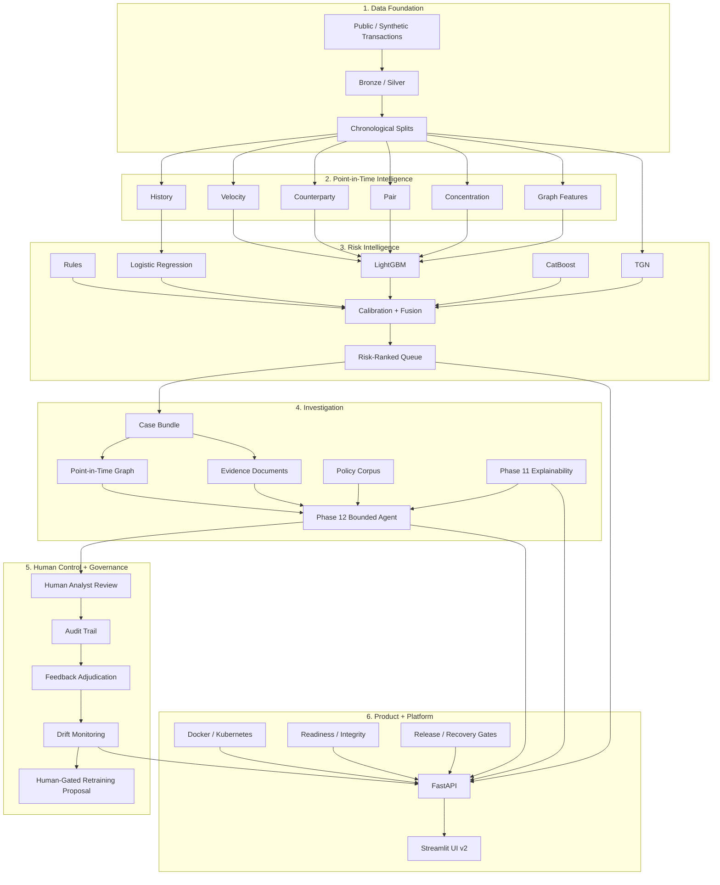

# GraphShield AML — Architecture

## System view

## Design principles

1. **Point-in-time correctness first** — model features must not use future information.
2. **Ranking instead of autonomous disposition** — GraphShield prioritizes analyst attention.
3. **Separate evidence channels** — deterministic reasons, model attribution, graph context, and policy context stay distinguishable.
4. **Fail closed for grounded generation** — unsupported claims should be withheld rather than improvised.
5. **Certified artifacts are immutable during later governance phases.**
6. **Humans own final case and regulatory decisions.**
7. **Deployment readiness is not the same as production performance.**
