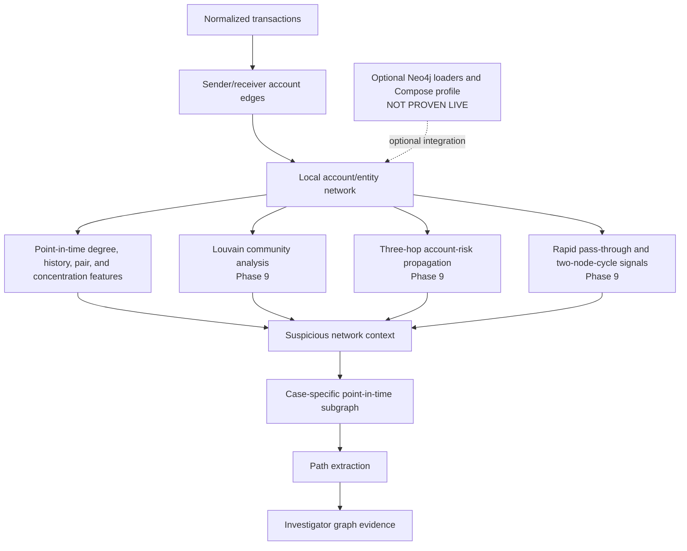

# Graph Investigation Flow

The demonstrated core is local graph intelligence built from repository tables and NetworkX community analysis. Neo4j is an optional integration, not a required or proven-live component of this flow.
