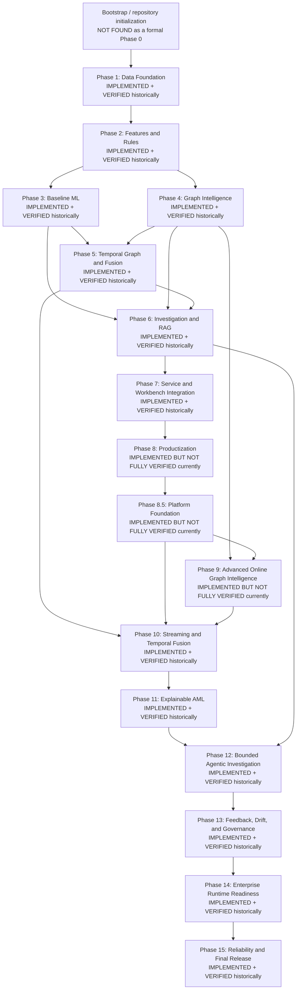

# Phase Architecture

The repository history is cumulative: later phases depend on earlier artifacts and contracts. Status labels are evidence-oriented and historical certifications are not fresh verification claims.

The detailed recovered status and supporting references are in [Phase Index](PHASE_INDEX.md). “Historically” means backed by committed reports, tests, and/or validation artifacts; it is not a claim that all gates were rerun for this documentation change.
