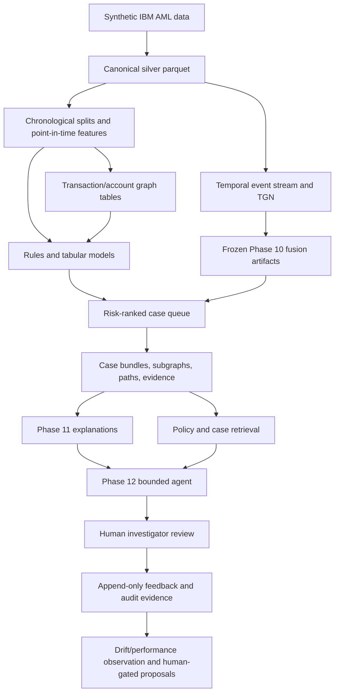

# Project Architecture

## Scope and evidence boundary

This document describes the code and local artifacts present in GraphShield AML. It distinguishes implemented repository capabilities from optional infrastructure configuration. It does not claim a production deployment, regulatory certification, or performance on real banking data.

## Diagram set

- [System Overview](SYSTEM_OVERVIEW.md)
- [Execution Lifecycle](EXECUTION_LIFECYCLE.md)
- [Transaction-to-Case Flow](TRANSACTION_TO_CASE_FLOW.md)
- [Graph Investigation Flow](GRAPH_INVESTIGATION_FLOW.md)
- [Evidence and Policy Flow](EVIDENCE_AND_POLICY_FLOW.md)
- [Safety Control Plane](SAFETY_CONTROL_PLANE.md)
- [Phase Architecture](PHASE_ARCHITECTURE.md)

## Implemented system flow

## Components

| Layer | Implemented responsibilities | Principal locations |
|---|---|---|
| Data foundation | Canonical schema, silver normalization, data quality, chronological splits | `src/canonical`, `src/validation`, `data_contracts` |
| Features and rules | Historical, velocity, counterparty, pair, concentration, graph and rule features | `src/features`, `src/rules`, `src/graph` |
| Entity/graph intelligence | Account registry, transaction edges, point-in-time graph features, communities, propagation, motifs | `src/entity`, `src/graph` |
| Modeling | Tabular training, calibration, selection, graph ablation, model reports | `src/modeling` |
| Temporal intelligence | TGN events, PyTorch Geometric TGN training, checkpoint export, Phase 10 fusion | `src/temporal`, `src/streaming` |
| Investigation | Queue, case bundles, graph extraction, paths, evidence documents | `src/investigation`, `src/services` |
| Retrieval | Policy corpus/indexes, TF-IDF/dense retrieval, grounding validation | `src/retrieval` |
| Explainability | Graph-LightGBM TreeSHAP, reason codes, graph and temporal evidence, summaries | `src/explainability` |
| Governance | Feedback/adjudication, drift, performance and retraining-proposal gates | `src/governance` |
| Product/API | FastAPI routes and Streamlit UIs | `src/api`, `src/frontend`, `src/workbench` |
| Runtime/reliability | Artifact manifest, readiness/deployment gates, recovery and release checks | `src/enterprise`, `src/reliability` |

## Data stores and artifacts

The operational representation is primarily Parquet plus DuckDB/SQLite, rather than a mandatory graph database. Ignored local artifacts include raw/silver/gold transaction data, account/entity tables, graph tables, TGN events and node mappings, model artifacts, case stores, evidence, and policy indexes. The Phase 7 analyst state is a mutable SQLite database; Phase 13 feedback uses DuckDB. Certification manifests and reports are committed separately.

The data-contract source registry identifies IBM AML-Data LI-Small as synthetic. Runtime labels are not exposed as analyst evidence. See [Limitations](../LIMITATIONS.md).

## Graph lifecycle

1. Normalize transactions and identify account/bank relationships.
2. Build account nodes and transaction edges.
3. Compute only information available before the focal event for point-in-time features and case evidence.
4. Score/rank transactions; aggregate selected score context into account and network intelligence.
5. Extract case-specific subgraphs and suspicious paths for investigation.

NetworkX supports local community analysis. Neo4j loaders and a Compose profile are present, but a running Neo4j environment is optional/provisioned infrastructure rather than a demonstrated required runtime dependency.

## ML and temporal boundaries

The repository retains multiple model stages. Earlier reports name prior champions, while later Phase 10 artifacts record a frozen graph/TGN fusion candidate. The graph LightGBM component is the TreeSHAP target; the TGN contribution is presented as temporal/component context, not SHAP attribution. No model should be identified as the current authoritative model without consulting its phase manifest and artifact availability.

## Interfaces and platform contracts

FastAPI exposes core health, case, graph, intelligence, policy, explainability, Phase 12 investigation, Phase 13 governance, and Phase 14 readiness/deployment endpoints. Streamlit provides analyst-facing views. Docker and Kubernetes manifests include non-root/runtime, health-probe, integrity, autoscaling, and resilience contracts.

Compose profiles additionally provision Redis, Redpanda, MinIO, MLflow, Prometheus, Grafana, Keycloak, and Neo4j. Their configuration is implementation evidence for optional infrastructure; it is not evidence that these services are active or integrated in a live deployment.

## Human control plane

Human investigators retain case and regulatory authority. The system may rank, retrieve, summarize, monitor, and propose; it must not autonomously block an account, close a case, submit a filing, retrain, recalibrate, promote a model, or change thresholds. The complete constraints are maintained in [Safety Invariants](SAFETY_INVARIANTS.md).
