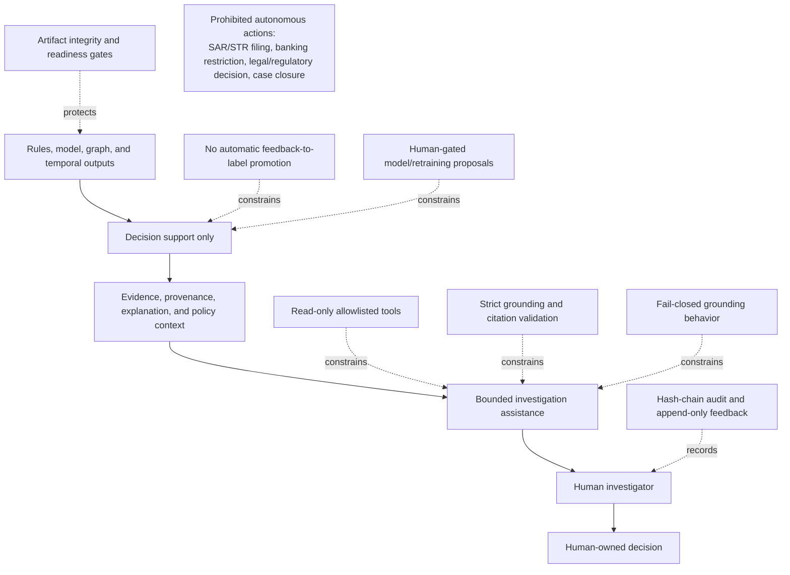

# Safety Control Plane

GraphShield is designed to turn machine outputs into reviewable evidence, not autonomous action.

The dashed safeguards are repository-supported controls: Phase 12 tool/grounding/audit contracts, Phase 13 governance contracts, and Phase 14 integrity checks. They do not constitute regulatory certification. The complete textual rules are in [Safety Invariants](SAFETY_INVARIANTS.md).
