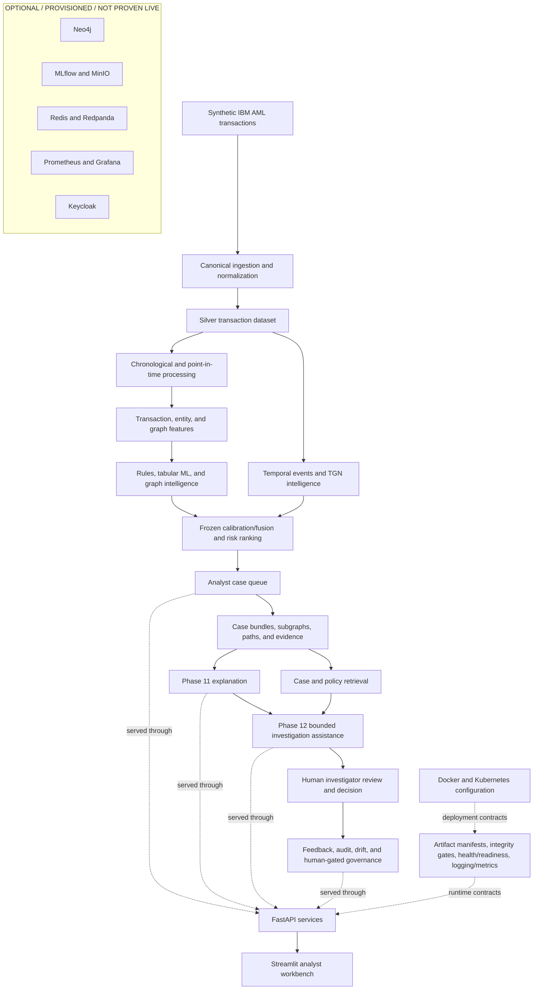

# System Overview

This is the repository-native, high-level view of GraphShield AML. Solid paths describe the implemented local workflow. The dashed box contains optional/provisioned infrastructure and is not evidence of a live deployment.

The local core uses Parquet, DuckDB/SQLite, model artifacts, and code under `src/`. Optional services are Compose-profile configuration, not demonstrated live dependencies. See [Project Architecture](PROJECT_ARCHITECTURE.md) and [Limitations](../LIMITATIONS.md).
